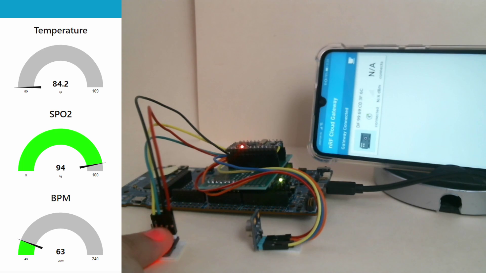
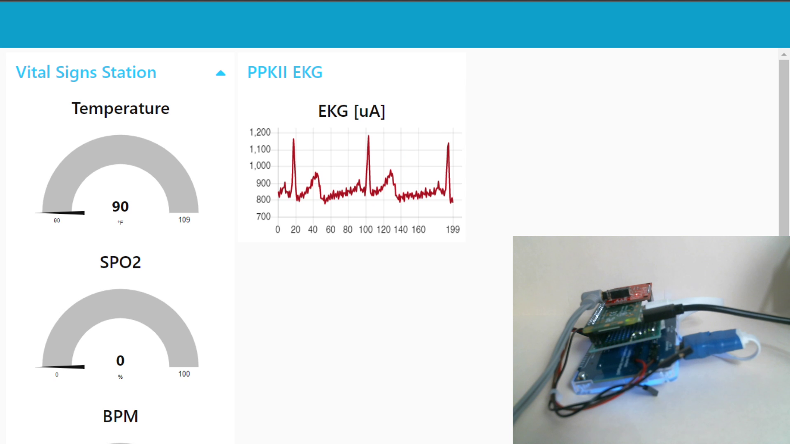

# EHM: Advanced Wearables

# Table of contents

- [EHM: Advanced Wearables](#ehm-advanced-wearables)
- [Table of contents](#table-of-contents)
- [Introduction:](#introduction)
- [Solution:](#solution)
- [Materials:](#materials)
- [Connection Diagram:](#connection-diagram)
  - [**ECG System**:](#ecg-system)
  - [**nRF5340**:](#nrf5340)
- [Project:](#project)
- [nRF5340 Setup:](#nrf5340-setup)
    - [Read Sensor Data:](#read-sensor-data)
    - [**Ble**:](#ble)
- [Power Consumption:](#power-consumption)
- [EKG Device:](#ekg-device)
  - [**AD8232**:](#ad8232)
  - [**RPI**:](#rpi)
  - [**MQTT RPI Server**:](#mqtt-rpi-server)
- [Node RED UI:](#node-red-ui)
  - [**Setup nRF MQTT**:](#setup-nrf-mqtt)
  - [**Setup PPKII MQTT**:](#setup-ppkii-mqtt)
- [The Final Product:](#the-final-product)
    - [Epic DEMO:](#epic-demo)
- [Commentary:](#commentary)
  - [References:](#references)

# Introduction:

Many factors of daily life can permanently affect cardiac function.

Such as:
- Sedentarism.
- Diet full of Salt, saturated fats and refined sugar.
- Alcoholic intake.
- Smoking.
- High blood pressure.
- Obesity.
- Family history of heart disease.
- History of a previous heart attack.
- Age over 45 for men, or over 55 for women.
- Male gender (there's a direct correlation for cardiovascular disease).
- Substance abuse.
- Low potassium or magnesium.

Cardiovascular diseases are the LEADING cause of death worldwide and in all regions. In 2008, 30% of all global death was attributed to cardiovascular diseases.

Some projections by the AHA say that by 2035 half of the population in the US will have some form of CVD, and in Mexico we are in the same track. ITs prevalence increases directly with age and as we all know our population is growing old.

Its cost in 2016 was 555 billion dollars and will almost triple by 2035, the most important fact that I wish you to remember, is that it is the most expensive chronic illness and the one with most mortality even beating those in the public eye.

The AHA at the same time recommends that all our efforts should be focused on these three areas: research prevention and affordable health care so our project will try to impact them all.

This brings us to our pain point:
Quite a lot of people have to undergo cardiac tests frequently in expensive hospitals with gigantic measuring devices. We are in a time where open health is stronger than ever and it is time to make the patient the point of care.

One thing that we have to notice first. The first wave of wearables has already come out in the market and the results are not that great. The main issue that Doctors put forth is that it is too much information, think of the internet before data aggregators, it has no value if it cannot be interpreted correctly and that is something that has to be taken into consideration. A solution should aggregate all that data and provide carers with useful information.

References:
* healthmetrics.heart.org/wp-content/uploads/2017/10/Cardiovascular-Disease-A-Costly-Burden.pdf
* World health Organization
* www.mdedge.com/ccjm/article/203527/cardiology/ambulatory-ecg-monitoring-age-smartphones
* en.wikipedia.org/wiki/Cardiovascular_disease

# Solution:

Because of the above reasons through AWS's and Nordic's technology we will create a real-time heart rate monitoring system and a dashboard deployment, that will be out of the box secure, from the MCU, to the OS, to the cloud. Healthcare data is our most valuable one, and it is evident that this kind of security must become the norm in every device.

It will be a ECG/EKG Holter monitor with heart rate analysis and dashboard. Cloud based and powered by Nordic Semiconductors. 
Medical devices are working with technology from the past. Today, in the middle of the fourth industrial revolution, it is a shame that a similar device like the proposed one has to work through data stored in SD memories. Instead of being able to send real-time data to the cloud through IoT, to be able to generate Big data, which will later serve for machine learning models to give doctors valuable information in a simple user interface.

The current solutions of these systems are:

www.med-electronics.com/Welch-Allyn-HR-100-Holter-Recorder-p/401700.htm

$ 1,360.00

www.med-electronics.com/Welch-Allyn-HR-300-Holter-Recorder-p/401704.htm

$ 2,375.00

Both systems have a clear disadvantage, these are monitors that work through SD memories, they do not allow real-time monitoring, the patient has to return daily with the doctor and deliver the SD of the analysis or take them out, put them in a computer and send them by mail, the doctor subsequently has to analyze them manually, etc.

As we can see, these types of solutions are a clear example of how obsolete medical equipment is today.

# Materials:

Hardware:
- nRF5340 DK                            x1.
  - https://www.nordicsemi.com/Software-and-tools/Development-Kits/nRF5340-DK
- Atmega328P
  - https://components101.com/microcontrollers/atmega328p-pinout-features-datasheet
- AD8232 ECG.                           x1.
  - https://www.amazon.com/dp/B0111QV7OY/ref=cm_sw_em_r_mt_dp_FQGJQZ9VQ1VBSPFJTSKW
- MLX90614. x1.
  - https://www.amazon.com/dp/B07YZVDWWB/ref=cm_sw_em_r_mt_dp_QS0EMD50GRHS5W7FN742?_encoding=UTF8&psc=1
- MAX30102 x1.
  - https://www.amazon.com/dp/B07QC67KMQ/ref=cm_sw_em_r_mt_dp_CVR2WBWTF58J3DM90V79
- Power Profiler Kit II.                x1.
  - https://www.nordicsemi.com/Software-and-tools/Development-Tools/Power-Profiler-Kit-2
- Rpi Zero W.                           x1.
    - https://www.amazon.com/dp/B07BHMRTTY/ref=cm_sw_em_r_mt_dp_9NRSPWM9RA6SGEH4BBS0
- Smartphone Gateway.                   x1.

Software:
- nRF Connect:
  - https://www.nordicsemi.com/Software-and-tools/Development-Tools/nRF-Connect-for-desktop
- Python:
  - https://www.python.org/
- Segger Embedded Studio:
  - https://www.segger.com/products/development-tools/embedded-studio/
- nRF Cloud:
  - https://nrfcloud.com/

# Connection Diagram:

This is the connection diagram of the system:

## **ECG System**:

## **nRF5340**:

# Project:

The project is divided into two main branches, the use of the nRF5340 as a vital signs monitor and the PPKII as an ECG, I will explain both in detail, starting with the nRF5340.

# nRF5340 Setup:

The complete project will be in the folder "nRF Project":

As the official documentation indicated, the hci_rpmsg project was used for the device's Network layer from Segger Embedded Studio v1.5.1.

The application for the CORE layer is in the nRF Project folder.

### Read Sensor Data:

To read the sensors, an Atmega328P was used as a driver to read the sensors easily and send the information to the nRF5340. as shown by the [scheme] (# nrf5340). A proprietary transmission protocol was used, inspired by the communication of LCD Displays. 

| Micro PIN        |       Board PIN  |
|------------------|------------------|
| D2               | P1.04   (input)  |
| D3               | P1.05   (input)  |
| D4               | P1.06   (input)  |

The data sent from the microcontroller to the board is at 16 bits, the first 8 bits being the data to send and the other 8 the sensor number.

    static unsigned int temp = 0;
    temp = readTriWire();
    if (temp >> 8 != 0)
    {
        if (temp >> 8 == 1)
        {
            memory = temp & 0x00FF;
        }
        else if (temp >> 8 == 2)
        {
            memory = memory<<8;
            memory = memory + (temp & 0x00FF);
        }
        else if (temp >> 8 == 3)
        {
            memory = memory<<8;
            memory = memory + (temp & 0x00FF);
        }
        else if (temp >> 8 == 4)
        {
            memory = memory<<8;
            memory = memory + (temp & 0x00FF);
            spo_val = memory;
            bt_gatt_notify(NULL, &stsensor_svc->attrs[2], &spo_val, sizeof(spo_val));
        }
        printk("%d \n",(temp & 0x00FF));
    }

Each data received is inserted into a 32-bit memory variable, once we receive the 4 values, we send them to the BLE notify.

### **Ble**:

For the BLE notification, a 32-bit variable is being sent, with a data encoded every 8 bits.

| Byte             |       Sensor     |
|------------------|------------------|
| 1                | SPO2             |
| 2                | BPM              |
| 3                | Temperature      |
| 4                | NONE             |

Here is an example of how the information gets to nRF connect.

To see the transmission more clearly, record a video of how the data arrives in real time to the cloud and to the platform that you carry out in Node-RED (more details at [Node RED UI](#node-red-ui)).

Video: Click on the image

# Power Consumption:

As we can see, our device has a consumption of 50mAh.

# EKG Device:

## **AD8232**:

The main idea of the project was originally to take EKG measurements through the power profiler kit ii. The circuit used to measure the ECG is an AD8232 module, however it outputs a voltage, not a current.

So for us to be able to turn this circuit into a current measurement circuit, we must include a resistor and put the PPKII in series with the resistor to close the circuit.

With this circuit we will now be able to measure the current that will pass through the resistance, which corresponds to the ECG wave. Here is a video example of an ECG capture with the PPKII.

## **RPI**:

However, having it connected to a PC to make measurements seemed absurd to us, so to use the PPKII we used a Raspberry Pi Zero.

Libreria utilizada:
https://github.com/IRNAS/ppk2-api-python

In the end the circuit used to make the EKG measurements with the raspberry is this:

## **MQTT RPI Server**:

All the code implemented to perform the measurements and send them to Node-RED is in the RPI Software folder at our Github that you can find below.

However, it must be mentioned that all the data that reaches Node-RED is sent through MQTT, this MQTT server is installed on the Raspberry through Mosquitto.

https://mosquitto.org/

We recommend using an MQTT installed directly from a service provider such as AWS for added security.

# Node RED UI:

For the deployment of this system we decided to use Node-RED, due to its ease of use and ability to generate dashboards it seemed the most appropriate.

## **Setup nRF MQTT**:

Fortunately for us, nRF Cloud has its own mqtt service, as the official documentation says.

https://nrfcloud.com/#/docs/guides/mqtt

Following that guide I was able to configure the credentials of the MQTT server, the service is mounted on AWS, therefore we require the following to be able to successfully make the connection.

* Endpoint.
* Gateway Topic.
* ClientID
* caCert
* clientCert
* privateKey

To configure this data in Node-RED we must enter the MQTT node.

By clicking on the pencil symbol we can configure all the MQTT service.

Once everything is configured, we can receive all the data sent by the nRF5340 to nRF Cloud, here is an example of how we are receiving the 4 values in the Node-RED platform.

To filter each value to its corresponding graph, the following functions were used.

    let p=JSON.parse(msg.payload);
    p = p["message"]["event"]["characteristic"]
    p = { payload: p["value"][0]}; 
    return p;

Thus we will obtain graphs with the values of each sensor.

In the video already shown above we will see the graphs receiving the data in real time.

Video: Click on the image

## **Setup PPKII MQTT**:

In the case of Raspberry, the setup is much easier, since we will only have to put the IP of the raspberry as server and the topic "/station/1/hr".

Here is a video of the platform receiving the data from the PPKII.

Video: Click on the image

# The Final Product:

Vital Signs Station:

ECG Station:

### Epic DEMO:

Video: Click on the image

# Commentary:

// Pending

## References:

* healthmetrics.heart.org/wp-content/uploads/2017/10/Cardiovascular-Disease-A-Costly-Burden.pdf
* World health Organization
* www.mdedge.com/ccjm/article/203527/cardiology/ambulatory-ecg-monitoring-age-smartphones
* en.wikipedia.org/wiki/Cardiovascular_disease
