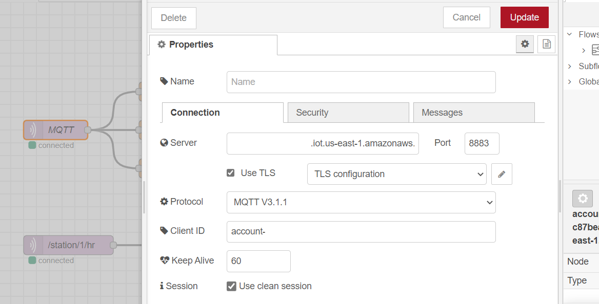

# EHM: Advanced Wearables

# Table of contents

- [EHM: Advanced Wearables](#ehm-advanced-wearables)
- [Table of contents](#table-of-contents)
- [Introduction:](#introduction)
- [Solution:](#solution)
- [Materials:](#materials)
- [Connection Diagram:](#connection-diagram)
  - [**ECG System**:](#ecg-system)
  - [**nRF5340**:](#nrf5340)
- [Project:](#project)
- [nRF5340 Setup:](#nrf5340-setup)
    - [Read Sensor Data:](#read-sensor-data)
    - [**Ble**:](#ble)
- [EKG Device:](#ekg-device)
  - [**AD8232**:](#ad8232)
  - [**RPI**:](#rpi)
  - [**MQTT RPI Server**:](#mqtt-rpi-server)
- [Node RED UI:](#node-red-ui)
  - [**Setup nRF MQTT**:](#setup-nrf-mqtt)
  - [**Setup PPKII MQTT**:](#setup-ppkii-mqtt)
- [The Final Product:](#the-final-product)
    - [Epic DEMO:](#epic-demo)
- [Commentary:](#commentary)
  - [References:](#references)

# Introduction:

Many factors of daily life can permanently affect cardiac function.

Such as:
- Sedentarism.
- Diet full of Salt, saturated fats and refined sugar.
- Alcoholic intake.
- Smoking.
- High blood pressure.
- Obesity.
- Family history of heart disease.
- History of a previous heart attack.
- Age over 45 for men, or over 55 for women.
- Male gender (there's a direct correlation for cardiovascular disease).
- Substance abuse.
- Low potassium or magnesium.

Cardiovascular diseases are the LEADING cause of death worldwide and in all regions. In 2008, 30% of all global death was attributed to cardiovascular diseases.

Some projections by the AHA say that by 2035 half of the population in the US will have some form of CVD, and in Mexico we are in the same track. ITs prevalence increases directly with age and as we all know our population is growing old.

Its cost in 2016 was 555 billion dollars and will almost triple by 2035, the most important fact that I wish you to remember, is that it is the most expensive chronic illness and the one with most mortality even beating those in the public eye.

The AHA at the same time recommends that all our efforts should be focused on these three areas: research prevention and affordable health care so our project will try to impact them all.

This brings us to our pain point:
Quite a lot of people have to undergo cardiac tests frequently in expensive hospitals with gigantic measuring devices. We are in a time where open health is stronger than ever and it is time to make the patient the point of care.

One thing that we have to notice first. The first wave of wearables has already come out in the market and the results are not that great. The main issue that Doctors put forth is that it is too much information, think of the internet before data aggregators, it has no value if it cannot be interpreted correctly and that is something that has to be taken into consideration. A solution should aggregate all that data and provide carers with useful information.

References:
* healthmetrics.heart.org/wp-content/uploads/2017/10/Cardiovascular-Disease-A-Costly-Burden.pdf
* World health Organization
* www.mdedge.com/ccjm/article/203527/cardiology/ambulatory-ecg-monitoring-age-smartphones
* en.wikipedia.org/wiki/Cardiovascular_disease

# Solution:

Because of the above reasons through AWS's and Nordic's technology we will create a real-time heart rate monitoring system and a dashboard deployment, that will be out of the box secure, from the MCU, to the OS, to the cloud. Healthcare data is our most valuable one, and it is evident that this kind of security must become the norm in every device.

It will be a ECG/EKG Holter monitor with heart rate analysis and dashboard. Cloud based and powered by Nordic Semiconductors. 
Medical devices are working with technology from the past. Today, in the middle of the fourth industrial revolution, it is a shame that a similar device like the proposed one has to work through data stored in SD memories. Instead of being able to send real-time data to the cloud through IoT, to be able to generate Big data, which will later serve for machine learning models to give doctors valuable information in a simple user interface.

The current solutions of these systems are:

www.med-electronics.com/Welch-Allyn-HR-100-Holter-Recorder-p/401700.htm

$ 1,360.00

www.med-electronics.com/Welch-Allyn-HR-300-Holter-Recorder-p/401704.htm

$ 2,375.00

Both systems have a clear disadvantage, these are monitors that work through SD memories, they do not allow real-time monitoring, the patient has to return daily with the doctor and deliver the SD of the analysis or take them out, put them in a computer and send them by mail, the doctor subsequently has to analyze them manually, etc.

As we can see, these types of solutions are a clear example of how obsolete medical equipment is today.

# Materials:

Hardware:
- nRF5340 DK                            x1.
  - https://www.nordicsemi.com/Software-and-tools/Development-Kits/nRF5340-DK
- Atmega328P
  - https://components101.com/microcontrollers/atmega328p-pinout-features-datasheet
- AD8232 ECG.                           x1.
  - https://www.amazon.com/dp/B0111QV7OY/ref=cm_sw_em_r_mt_dp_FQGJQZ9VQ1VBSPFJTSKW
- MLX90614. x1.
  - https://www.amazon.com/dp/B07YZVDWWB/ref=cm_sw_em_r_mt_dp_QS0EMD50GRHS5W7FN742?_encoding=UTF8&psc=1
- MAX30102 x1.
  - https://www.amazon.com/dp/B07QC67KMQ/ref=cm_sw_em_r_mt_dp_CVR2WBWTF58J3DM90V79
- Power Profiler Kit II.                x1.
  - https://www.nordicsemi.com/Software-and-tools/Development-Tools/Power-Profiler-Kit-2
- Rpi Zero W.                           x1.
    - https://www.amazon.com/dp/B07BHMRTTY/ref=cm_sw_em_r_mt_dp_9NRSPWM9RA6SGEH4BBS0
- Smartphone Gateway.                   x1.

Software:
- nRF Connect:
  - https://www.nordicsemi.com/Software-and-tools/Development-Tools/nRF-Connect-for-desktop
- Python:
  - https://www.python.org/
- Segger Embedded Studio:
  - https://www.segger.com/products/development-tools/embedded-studio/
- nRF Cloud:
  - https://nrfcloud.com/

# Connection Diagram:

This is the connection diagram of the system:

## **ECG System**:

## **nRF5340**:

# Project:

El proyecto esta dividido en dos grandes ramas, la utilicacion de la nRF5340 como monitor de signos vitales y el PPKII como ECG, explicare a detalle ambos, empezando por el nRF5340.

# nRF5340 Setup:

El projecto completo estara en la carpeta "nRF Project"

Como indicaba la documentacion oficial, se utilizo para la capa de Network del deispositivo el proyecto hci_rpmsg desde el Segger Embedded Studio v1.5.1. 

La aplicacion para la capa de CORE esta en la capeta nRF Project.

### Read Sensor Data:

Para hacer la lectura de los sensores se utilizo un Atmega328P como driver para leer los sensores facilmente y mandar la informacion a la nRF5340. como muestra el esquema [scheme](#nrf5340). Se utilizo un protocolo de transmision propio inspirado en la comunicacion de las LCD Displays.

| Micro PIN        |       Board PIN  |
|------------------|------------------|
| D2               | P1.04   (input)  |
| D3               | P1.05   (input)  |
| D4               | P1.06   (input)  |

Los datos mandados desde el microcontrolador a la board son de 16 bits, siendo los primeros 8 bits el dato a mandar y los otros 8 el numero de sensor.

    static unsigned int temp = 0;
    temp = readTriWire();
    if (temp >> 8 != 0)
    {
        if (temp >> 8 == 1)
        {
            memory = temp & 0x00FF;
        }
        else if (temp >> 8 == 2)
        {
            memory = memory<<8;
            memory = memory + (temp & 0x00FF);
        }
        else if (temp >> 8 == 3)
        {
            memory = memory<<8;
            memory = memory + (temp & 0x00FF);
        }
        else if (temp >> 8 == 4)
        {
            memory = memory<<8;
            memory = memory + (temp & 0x00FF);
            spo_val = memory;
            bt_gatt_notify(NULL, &stsensor_svc->attrs[2], &spo_val, sizeof(spo_val));
        }
        printk("%d \n",(temp & 0x00FF));
    }

Cada dato recibido se inserta en una variable memory de 32 bits, una vez recibimos los 4 valores, los mandamos a la notify de BLE.

### **Ble**:

Para la notificacion de BLE se esta mandando una variable de 32 bits, con un dato codificado cada 8 bits.

| Byte             |       Sensor     |
|------------------|------------------|
| 1                | SPO2             |
| 2                | BPM              |
| 3                | Temperature      |
| 4                | NONE             |

Aqui un ejemplo de como llega a nRF connect la informacion.

Para ver la transmision mas claramente grabe un video de como los datos llegan en tiempo real a la cloud y a la plataforma que realice en Node-RED (mas detalles en [Node RED UI](#node-red-ui)).

Video: Click on the image

# EKG Device:

## **AD8232**:

La idea principal del proyecto, originalmente fue el hacer nmediciones de un EKG a travez de el power profiler kit ii. El circuito utilizado para medir el ECG es un modulo AD8232, sin embargo este tiene como output un voltaje, no una corriente.

Entonces para nosotros poder convertir este circuito en un circuito para medir corriente, debemos incluir una resistencia y poner el PPKII en serie con la resistencia para cerrar el circuito.

Con este circuito ahora si seremos capaces de medir la corriente que pasara a atravez de la resistencia, la cual corresponde con la onda del ECG. Aqui un ejemplo en video de la captura de un ECG con el PPKII.

## **RPI**:

Sin embargo tenerlo conectado a una PC para hacer mediciones me parecio absurdo, asi que para utilizar el PPKII utilice una Raspberry Pi Zero.

Libreria utilizada:
https://github.com/IRNAS/ppk2-api-python

Al final el circuito utilizado para hacer las mediciones de EKG con la raspberry es este.

## **MQTT RPI Server**:

Todo el codigo implementado para realizar las mediciones y mandarlas a Node-RED esta en la carpeta RPI Software.

Sin embargo hay que mencionar que todos los datos que llegan al Node-RED se mandan a travez de MQTT, este server de MQTT esta instalado en la Raspberry a travez de Mosquitto.

https://mosquitto.org/

Recomendamos que se utilice un MQTT directamente instalado en un proveedor de servicios como AWS para mayor seguridad.

# Node RED UI:

Para el deploy de este sistema decidi utilizar Node-RED, debido a su faciilidad de uso y capacidad de generar dashboards me parecio lo mas adecuado.

## **Setup nRF MQTT**:

Por fortuna para mi, nRF Cloud cuenta con su propio servicio de mqtt, como dice la documentacion oficial.

https://nrfcloud.com/#/docs/guides/mqtt

Siguiendo esa guia pude configurar las credenciales de el servidor de MQTT, el servicio esta montado en AWS, por lo tanto requerimos lo siguiente para poder realizar exitosamente la conexion.

* Endpoint.
* Gateway Topic.
* ClientID
* caCert
* clientCert
* privateKey

Para configurar estos datos en Node-RED deberemos entrar al nodo de MQTT.

Al hacer clic en el simbolo de lapiz podremos configurar todo el sevicio de MQTT.

Una ves esta todo configurado, podremos recibir todos los datos que mande la nRF5340 a nRF Cloud, aqui un ejemplo de como estamos recibiendo los 4 valores en la plataforma de Node-RED.

Para filtrar cada valor a su grafica correspondiente se utilizaron las siguientes funciones.

    let p=JSON.parse(msg.payload);
    p = p["message"]["event"]["characteristic"]
    p = { payload: p["value"][0]}; 
    return p;

Asi obtendremos graficas con los valores de cada sensor.

En el video ya mostrado anteriormente veremos las graficas recibiendo los datos en tiempo real.

Video: Click on the image

## **Setup PPKII MQTT**:

En el caso de Raspberry, es mucho mas sencillo el setup, ya que solo tendremos que poner la IP de la raspberry como server y el topic "/station/1/hr".

Aqui un video de la plataforma recibiendo los datos del PPKII.

Video: Click on the image

# The Final Product:

Product:

### Epic DEMO:

Video: Click on the image

# Commentary:

// Pending

## References:

* healthmetrics.heart.org/wp-content/uploads/2017/10/Cardiovascular-Disease-A-Costly-Burden.pdf
* World health Organization
* www.mdedge.com/ccjm/article/203527/cardiology/ambulatory-ecg-monitoring-age-smartphones
* en.wikipedia.org/wiki/Cardiovascular_disease

